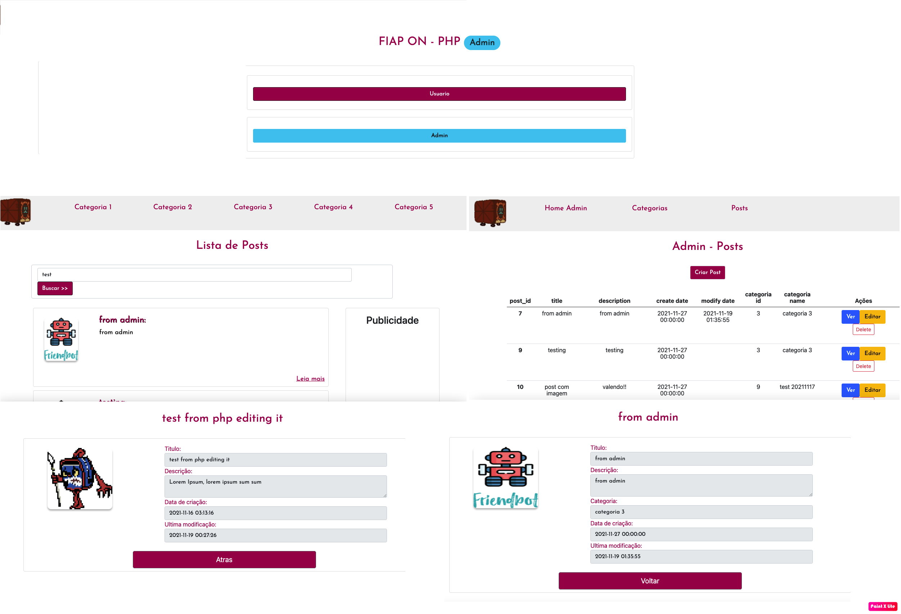

Trabalho da FIAP SION
Grupo Dollyboys

## Setup
1. Clonar o repositorio
2. Configurar o arquivo db>db_model>conn.inc.php  com as credenciais de um usuario com privilegios para exeuctar queries no banco de dados.
Exemplo:
```
$hostname="192.168.64.2";  //pode ser localhost ou IP da maquina
$db_name="diario_bordo";  //nome do banco de dados que sera criado com o script sql
$user="fiap";  
$passw="fiap";
$conn = new PDO("mysql:host=$hostname;dbname=$db_name",$user,$passw);
```
## Config

1. Executar o SQL script para a criação do banco de dados: db_model>diario_bordo.sql
2. Conceder permisos ao directorio /storage/uploads para o usuario apache

## Site
1. As paginas do usuario se encontra no directorio /app/
2. Modo admin se encontra encontra no directorio /admin

<p align="center">
  
</p>
